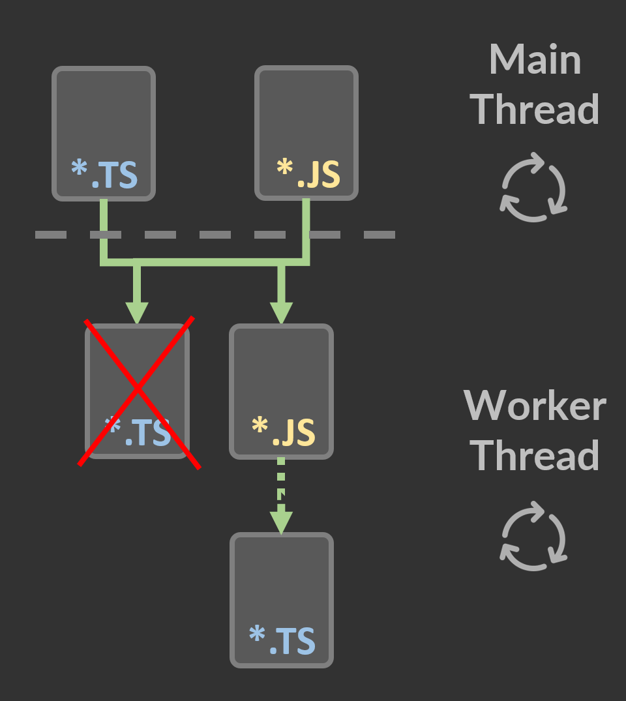

# NodeJS Multithreading 01

System Message

### Environment :
```
NodeJS minimal version: v12.x.x LTS (Erbium)
NodeJS recommended version: Latest LTS version
Dev Language: TypeScript (ES6)
Run Language: JavaScript
```
See [Latest NodeJS LTS version](https://nodejs.org/)

### How to run

#### First

Install packages

```
npm run i
```

#### Then

To run in Development
```
npm run start:dev
```

To run in Production
```
npm run start
```


## Explanations


### Main Thread Side

NodeJS multithreading also called "Worker" is imported from the library "worker_threads".

```ts
import { Worker } from 'worker_threads';
```

You can now instantiate a Worker by passing the path of an "entry point" file.

```ts
const myWorker: Worker = new Worker('./myWorker.js');
```

As you can see, I used a JS file. 

It is not possible to start a Worker using TS file, but there is a workaround.

### Proxy

As you can't execute TypeScript directly into your worker, you have to "compile" it into JavaScript.

```js
const path = require('path');
require('ts-node').register();
require(path.resolve(__dirname, 'myWorker.ts'));
```

<div align="center">

</div>

### Worker Thread Side

A very simple example of worker that just log a message.

You can trigger error event on Main Thread by uncomment the last line.

```ts
(() => {
  console.log(`[Worker] I'm the worker thread`);
  // Uncomment following line to catch an error
  // const a = b;
})();
```

Let's get back to the main thread.

### Main Thread Side

```ts
// On worker online
myWorker.on('online', () => {
  console.log(`[Main] Worker is online and executing code!`);
});

// On worker exit
myWorker.on('exit', code => {
  console.log(`[Main] Worker execution is over with code: ${code}`);
});

// On worker error
myWorker.on('error', error => {
  // Sometime stack is undefined, we can stringify error instead
  console.log(
    `[Main] Worker catch an error: ${error.stack || JSON.stringify(error)}`,
  );
});
```

You can subscribe on worker event.

'online' allow you to know when your worker is online. It can take several seconds between the instanciate call and the real thread execution.

'exit' allow you to know when your worker terminate and with which code.

Finally, 'error' allow you to know if error has been catched and the nature of it.

## Next Chapter

Multithreading 02 - Basic Thread Communication  
https://github.com/thomaspiquet/nodejs-multithreading-02